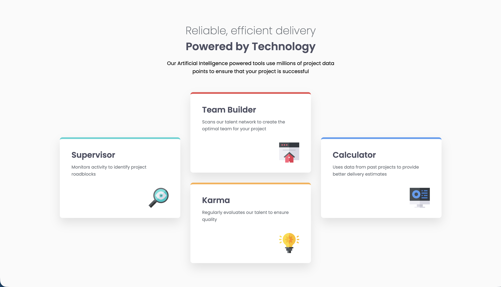
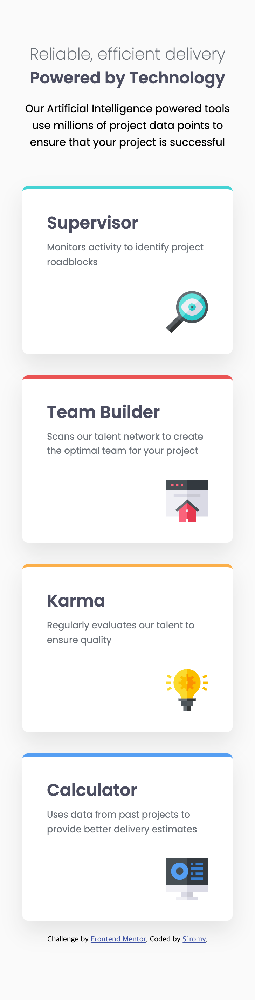

# Frontend Mentor - Four card feature section solution

This is a solution to the [Four card feature section challenge on Frontend Mentor](https://www.frontendmentor.io/challenges/four-card-feature-section-weK1eFYK).

## Table of contents

- [Overview](#overview)
  - [Screenshot](#screenshot)
  - [Links](#links)
- [My process](#my-process)
  - [Built with](#built-with)
  - [What I learned](#what-i-learned)
  - [Continued development](#continued-development)
- [Author](#author)

## Overview

### Screenshot

**Desktop**


**Mobile**


### Links

- Solution URL: [Frontend Mentor](https://www.frontendmentor.io/solutions/four-card-feature-section-4rVDkQYWPb)
- Live Site URL: [GitHub Pages](https://s1romy.github.io/fm-four-card-feature-section/)

## My process

### Built with

- Semantic HTML5 markup
- CSS Grid
- Flexbox
- Mobile-first workflow

### What I learned

In this project, I experimented with CSS Grid to build a staggered, cascading layout. Specifically, I utilized 'grid-row' and 'align-self' to break the standard grid flow and create more dynamic visual hierarchies. It was a great exercise in understanding how to position elements precisely within a grid container.

```css
.supervisor {
  grid-row: 1 / 3;
  align-self: center;
}
```

### Continued development

Moving forward, I plan to dive deeper into complex grid structures and focus on mastering advanced responsive design techniques.

## Author

- Frontend Mentor - [@yourusername](https://www.frontendmentor.io/profile/s1romy)
- GitHub - [@yourusername](https://github.com/s1romy)
